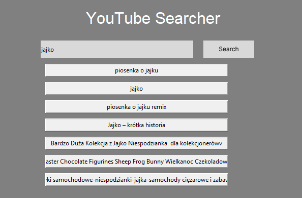

# Youtube-tkinter-Search-and-Download

# Creators
--------------------------------------------------

Manager: Jan Miepariszwili 
Documention: Tobiasz Twardak  
Main coders: Filip Zabrzewski, Fabian Stadnik, Andrzej Wieliczko

---------------------------------------------------

# Content of Project
* [General info](#general-info)
* [Technologies](#technologies)
* [Setup](#setup)
* [Application view](#application-view)

## General info

Click here

<li>The program is designed for searching YouTube videos and downloading them.  
<li>It allows users to quickly and easily download YouTube videos.  
<li>The main advantage of this program is that it eliminates the need for a YouTube Premium subscription, which is required for direct downloads on YouTube.

## Technologies
The project was built using the following technologies:  
<li>Programming language: Python 3.12.2  
<li>Python Libraries:
<ul><li>requests - for handling HTTP requests. 
<li>yt-dlp - for downloading videos from YouTube. 
<li>tkinter - for creating the graphical user interface (GUI). 
<li>google-api-python-client - to search results
</ul><li>Version Control Systems: Git

## Setup

Click here 

1. Create your API key by following the instructions below.   
2. Type the command 'python install.py' in the console, and all the required libraries will be downloaded automatically.   
3. Run the GUI2.py file.   
4. Enter the name of the video you are interested in into the search field. After clicking on your chosen result, our program will immediately start downloading it in MP4 format.   
5. The video will be downloaded to your computer.

### Instruction for creating an API key

Click here

1. Open google cloud 
2. Search youtube data api v3 
3. Click enable and manage 
 </img>  
4. Open credentials tab, click create credentials and API 
 </img>  
5. Copy your api key and open file API.py in youtube-tkinter-search-and-download folder
 
6. Paste your api in variable API = ""

## Application view

    

Click here

